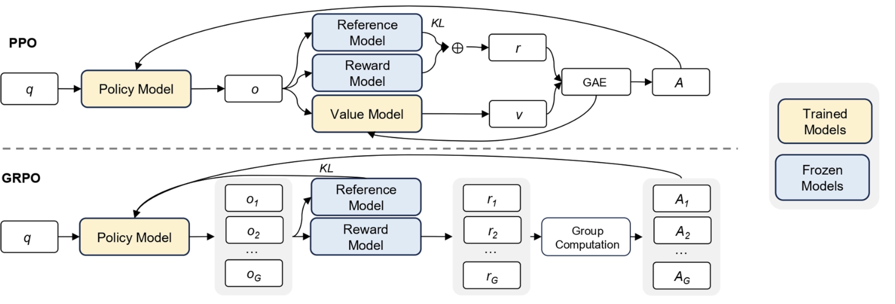

<style>
section {
  font-size: 24px;
}

h1 {
  font-size: 2.5em;
}

h2 {
  font-size: 2em;
}

li {
  font-size: 0.95em;
  line-height: 1.4;
}

.columns {
    display: grid;
    grid-template-columns: repeat(2, minmax(0, 1fr));
    gap: 1rem;
}
</style>

# **Building Your Own Reasoning Model**

Bandung.py Meetup
Bandung - 21 September 2025

*Ilham.F*

---

# Motivation

Topik ini kepikiran karena:

- Perkembangan sangat cepat di bidang AI/LLM
- Selama ini development fokus pada base model dan membutuhkan resource yang cukup besar
- Teknologi baru memungkinkan kustomisasi base model dengan resource yang jauh lebih kecil

**Disclaimer**

Saya bukan ahli matematikawan. Sudut pandang diskusi ini terkait dengan tools dan metode fine-tuning, jadi mohon di koreksi kalau ada yang salah terkait dengan materinya.

--- 

# Apa itu Reasoning Model?

- Model LLM memiliki keterbatasan pada task yang membutuhkan logika seperti menghitung.
- Beberapa cara yang bisa digunakan untuk solve masalah ini adalah:
  - Membuat prompt Chain-of-Thouht (CoT)
  - Menggunakan tool calling untuk memanggil fungsi atau menjalankan python script

Bagaimana cara untuk membuat model lebih capable tanpa menggunakan prompting dan tools?


*Referensi: [Prompting Engineering Guide - Chain-of-Thought Prompting](https://www.promptingguide.ai/techniques/cot)*

---

# Apa itu Reasoning Model

Solusi:

- Memasukkan proses berpikir ke dalam model LLM
- Model LLM biasa hanya terdiri dari 2 jenis token yaitu `input` dan `output`.
- Model reasoning menambahkan 1 jenis token lagi yaitu `reasoning`.

```markdown
User: {question}
Assistant: {think_tag}
{reasoning}
{think_end_tag}
{answer_tag}
{solution}
{answer_end_tag}
```

---

# <!-- fit --> Reinforcement Learning menggunakan GRPO

Reinforcement Learning dengan **Group Relative Policy Optimization** (GRPO)

- Sebuah metode yang menggunakan `agent` di sebuah `environment` secara mandiri belajar sebuah skill dengan menggunakan`reward` dan/atau `penalty`
- Metode ini sudah banyak digunakan di dalam proses training. Yang paling terkenal digunakan adalah **Reinforcement Learning with Human Feedback** (RLHF).

Apa beda nya dengan GRPO?


---

# <!-- fit --> Reinforcement Learning menggunakan GRPO

<div class="columns">
<div>

<strong>RLHF</strong>


- **Policy Model** - LLM Model yang sedang di training
- **Reference Model** - LLM original model
- **Value Model** - Fungsi untuk menghitung estimasi future reward
- **Reward Model** - Model untuk menghitung reward, hasil training dari preferensi manusia

</div>
<div>

<strong>GRPO</strong>


- **Menghilangkan Value Model**. Diganti dengan fungsi statistik
- **Menghilangkan Reward Model**. Diganti dengan custom reward yang bisa di verifikasi
  - Custom reward ini menggunakan fungsi yang bisa melakukan verifikasi secara mudah. Seperti 2+2=4

</div>
</div>

---

# <!-- fit --> Reinforcement Learning menggunakan GRPO



*Referensi: [Guo, D., Yang, D., Zhang, H. et al. DeepSeek-R1 incentivizes reasoning in LLMs through reinforcement learning. Nature 645, 633–638 (2025)](https://www.nature.com/articles/s41586-025-09422-z)*

---

# <!--fit---> Lesson Learned in Deepseek-R1-Zero and Deepseek-R1


*Referensi: [Guo, D., Yang, D., Zhang, H. et al. DeepSeek-R1 incentivizes reasoning in LLMs through reinforcement learning. Nature 645, 633–638 (2025)](https://www.nature.com/articles/s41586-025-09422-z)*

---

# <!--fit---> Lesson Learned in Deepseek-R1-Zero and Deepseek-R1


*Referensi: [Guo, D., Yang, D., Zhang, H. et al. DeepSeek-R1 incentivizes reasoning in LLMs through reinforcement learning. Nature 645, 633–638 (2025)](https://www.nature.com/articles/s41586-025-09422-z)*

---

# <!--fit---> Lesson Learned in Deepseek-R1-Zero and Deepseek-R1

**Benefit**

- GRPO menunjukkan metode baru yang sangat efisien dalam training reasoning model
- Dapat membuat reward function yang verifiable dibandingkan dengan preferensi manusia yang subjektif
- Sangat bagus pada task yang spesifik

---

# **Show me the code!**

- LLM base model: `Qwen3-4B-Base`
- Training framework: Unsloth, vLLM
- Dataset: [DAPO-Math-17k-Processed](https://huggingface.co/datasets/open-r1/DAPO-Math-17k-Processed)
- Environment (Google Colab):
  - GPU:T4, RAM:51 GB, Running Time:~250 menit, Training Step:100
  - GPU:A100, RAM:167 GB, Running Time:~40 menit, Training Step: 100

--- 

# Final Note

- GRPO menunjukkan perkembangan metode baru memungkinkan developer dengan keterbatasan resource untuk membuat model sendiri.
- Dengan dataset yang berkualitas, ada peluang untuk membuat model localized.
- Parameter untuk training bisa merujuk dari paper DeepSeek terbaru dan trial-and-error.

--- 

# Reference

- [Hugging Face - Build Reasoning Models](https://huggingface.co/learn/llm-course/en/chapter12/1?fw=pt)
- [Unsloth - Reinforcement Learning (RL) Guide](https://docs.unsloth.ai/basics/reinforcement-learning-rl-guide)
- [Unsloth - Train Your Own Reasoning Model with Unsloth (GRPO)](https://unsloth.ai/blog/r1-reasoning)
- [Prompting Engineering Guide - Chain-of-Thought Prompting](https://www.promptingguide.ai/techniques/cot)
- [Guo, D., Yang, D., Zhang, H. et al. DeepSeek-R1 incentivizes reasoning in LLMs through reinforcement learning. Nature 645, 633–638 (2025)](https://www.nature.com/articles/s41586-025-09422-z)
- [Guo, D., Yang, D., Zhang, H., Song, J., Zhang, R., Xu, R., ... & He, Y. (2025). Deepseek-r1: Incentivizing reasoning capability in llms via reinforcement learning. arXiv preprint arXiv:2501.12948.](https://arxiv.org/abs/2501.12948)
